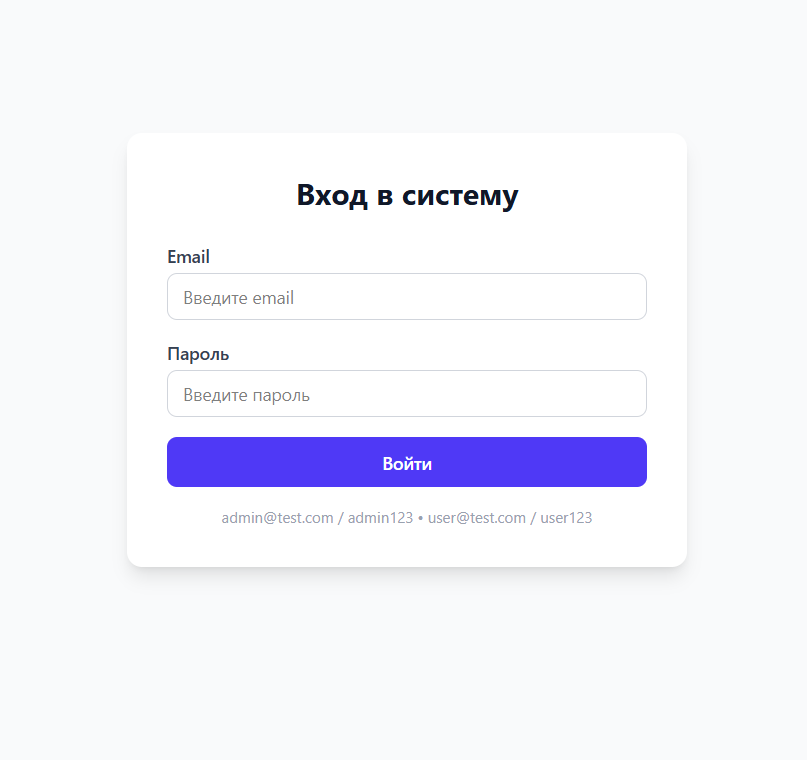
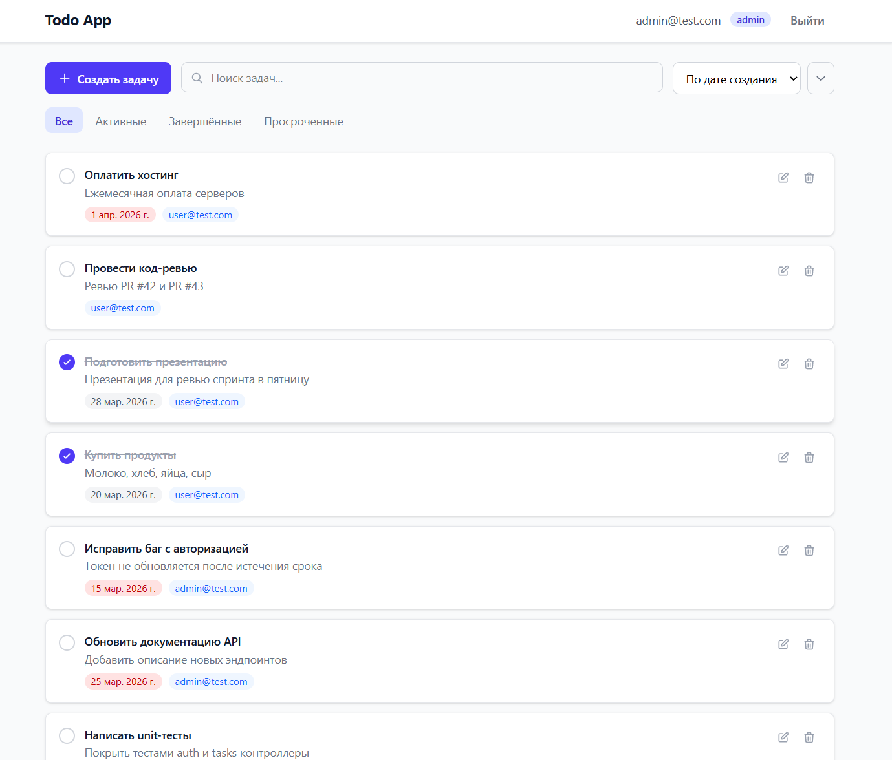

# Todo App

Полнофункциональное приложение для управления задачами с авторизацией и ролевой моделью.

## Стек технологий

| Часть     | Технологии                                      |
|-----------|------------------------------------------------|
| Frontend  | Nuxt 3, Vue 3, TypeScript, Tailwind CSS 4, Pinia |
| Backend   | Node.js, Express, TypeScript, JWT, UUID         |
| Инфра     | Монорепо, concurrently, ts-node-dev             |

## Скриншоты

### Страница входа


### Список задач


## Быстрый старт

```bash
# 1. Клонировать репозиторий
git clone <repo-url>
cd todo-app

# 2. Установить все зависимости (корень + frontend + backend)
npm run install:all

# 3. Создать файлы окружения
cp .env.example .env
cp frontend/.env.example frontend/.env

# 4. Запустить (frontend + backend параллельно)
npm run dev
```

- Frontend: http://localhost:3000
- Backend: http://localhost:3001

### Тестовые пользователи

| Email            | Пароль   | Роль  |
|------------------|----------|-------|
| admin@test.com   | admin123 | admin |
| user@test.com    | user123  | user  |

**admin** видит и редактирует все задачи, **user** — только свои.

## Переменные окружения

### Корневой `.env`

| Переменная     | По умолчанию                  | Описание                        |
|---------------|-------------------------------|--------------------------------|
| JWT_SECRET    | your-secret-key-change-in-production | Секретный ключ для JWT         |
| JWT_EXPIRES_IN | 24h                          | Время жизни токена              |
| API_PORT      | 3001                          | Порт backend-сервера           |
| FRONTEND_URL  | http://localhost:3000         | URL фронтенда (для CORS)       |

### `frontend/.env`

| Переменная    | По умолчанию              | Описание             |
|--------------|--------------------------|---------------------|
| API_BASE_URL | http://localhost:3001     | URL backend API      |

## API эндпоинты

### Авторизация

| Метод | Путь              | Описание               | Auth |
|-------|-------------------|------------------------|------|
| POST  | /api/auth/login   | Вход (email + password) | Нет  |

### Задачи

| Метод  | Путь              | Описание                          | Auth |
|--------|-------------------|-----------------------------------|------|
| GET    | /api/tasks        | Список задач (фильтры, пагинация) | Да   |
| POST   | /api/tasks        | Создать задачу                     | Да   |
| PUT    | /api/tasks/:id    | Обновить задачу                    | Да   |
| DELETE | /api/tasks/:id    | Удалить задачу                     | Да   |

#### GET /api/tasks — Query параметры

| Параметр | Тип    | По умолчанию | Значения                              |
|----------|--------|-------------|---------------------------------------|
| status   | string | all         | all, active, completed, overdue       |
| sort     | string | createdAt   | createdAt, dueDate, status            |
| order    | string | desc        | asc, desc                             |
| search   | string | —           | Поиск по title и description          |
| page     | number | 1           | Номер страницы                        |
| limit    | number | 10          | Задач на странице (макс. 100)         |

## Структура проекта

```
todo-app/
├── backend/
│   ├── src/
│   │   ├── index.ts                 ← точка входа, app.listen(3001)
│   │   ├── app.ts                   ← express, cors, json, роуты, errorHandler
│   │   ├── routes/
│   │   │   ├── auth.ts              ← POST /api/auth/login
│   │   │   └── tasks.ts            ← CRUD /api/tasks
│   │   ├── controllers/
│   │   │   ├── auth.controller.ts
│   │   │   └── tasks.controller.ts
│   │   ├── middleware/
│   │   │   ├── auth.ts              ← JWT верификация
│   │   │   ├── validate.ts          ← DTO валидация
│   │   │   └── errorHandler.ts
│   │   ├── dto/                     ← LoginDto, CreateTaskDto, UpdateTaskDto
│   │   ├── types/                   ← Task, User, JwtPayload, AppError
│   │   └── data/
│   │       └── store.ts             ← in-memory хранилище + seed данные
│   ├── tsconfig.json
│   └── package.json
├── frontend/
│   ├── app/
│   │   ├── pages/                   ← index, login, tasks
│   │   ├── components/              ← TaskCard, TaskList, TaskForm, TaskFilters...
│   │   │   └── ui/                  ← BaseButton, BaseInput, BaseModal...
│   │   ├── composables/             ← useAuth, useTasks, useNotification
│   │   ├── stores/                  ← auth (Pinia), tasks (Pinia)
│   │   ├── middleware/              ← auth route guard
│   │   ├── layouts/                 ← default, auth
│   │   ├── types/                   ← типы, совпадающие с backend
│   │   └── utils/                   ← api.ts (fetch + 401), validators.ts
│   ├── nuxt.config.ts
│   └── package.json
├── docs/
│   ├── api-spec.md
│   ├── design-reference.md
│   └── screenshots/
├── .env.example
├── CLAUDE.md
└── package.json                     ← корневой (concurrently)
```

## Функционал

- Авторизация по email/password с JWT
- Автоматический перехват 401 → редирект на /login
- CRUD задач через модальные окна
- Фильтрация по статусу (все / активные / завершённые / просроченные)
- Поиск по названию и описанию (debounce 300ms)
- Сортировка по дате создания, дедлайну, статусу
- Пагинация (10 задач на страницу)
- Ролевая модель: admin / user
- Валидация на клиенте и сервере
- Toast-уведомления
- Адаптивная вёрстка (mobile-first)
